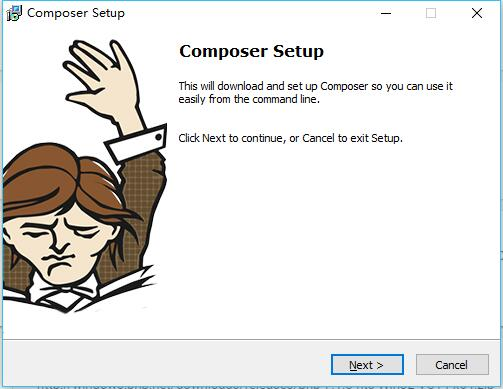
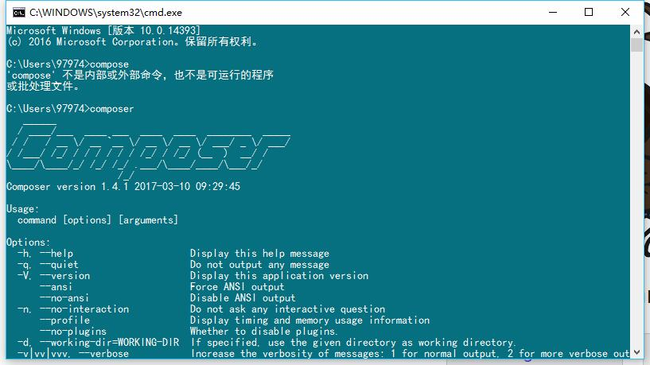
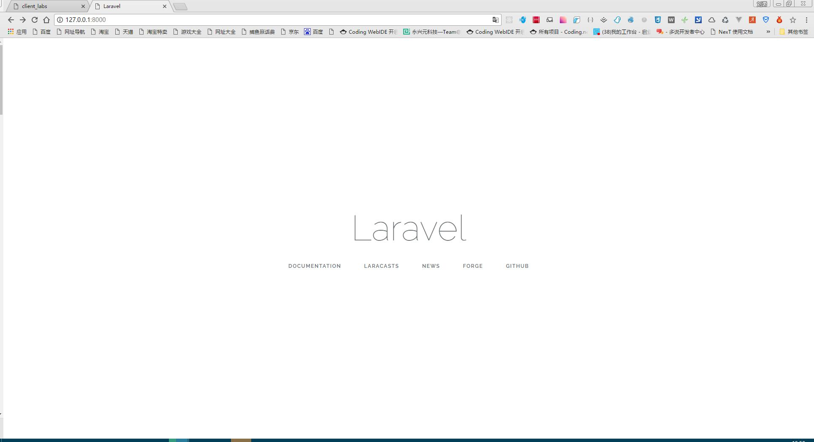

# labs
vue laravel project
## 初始化vue项目
vue项目初始化，很简单，只用全局安装vue-cli即可。
``` bash
$ npm install -g vue-cli
$ vue init webpack my-project
$ cd my-project
$ npm install
$ npm run dev
```
## 初始化laravel项目
### 安装php运行环境
由于咱也并非专业的php coder，所以我选择更简单的php环境包，phpstudy。下载地址：[http://www.phpstudy.net/phpstudy/phpStudy20161103.zip](http://www.phpstudy.net/phpstudy/phpStudy20161103.zip)
### 安装compose
下载安装包：[https://getcomposer.org/Composer-Setup.exe](https://getcomposer.org/Composer-Setup.exe)双击打开按照步骤一步步来即可！

安装完成，打开命令行工具
``` bash
composer
```
如果出现如下图所示即表示安装成功！


### 安装laravel
首先要把php的ssl打开，打开php.ini文件找到

```
// 去掉前面的分号
extension=php_openssl.dll 
```
这里的composer就是php界的npm包管理器，我们也可以这么想，但是这种玩意一般都是国外的，深处天朝的我们难免被墙，npm有淘宝这么个备胎，同样composer也有个国内备胎[https://pkg.phpcomposer.com/](https://pkg.phpcomposer.com/)
``` bash
composer config -g repo.packagist composer https://packagist.phpcomposer.com
```
这样虽然我们深处墙内也可以毫无障碍的窥探墙外世界。
接下来就是正式安装laravel的时候了
``` bash
composer create-project --prefer-dist laravel/laravel blog
```
然后就是等待安装完成！
``` bash
php artisan serve
```
之后打开[127.0.0.1:8000](127.0.0.1:8000)

然后我们就可以在vue里面愉快的玩了，但是还有个跨域的问题，由于端口号不同请求会被拒绝
``` bash
php artisan make:middleware Cors
```
打开 server_labs/app/Http/Middleware/Cors.php修改如下
``` php
// add in public function handle($request, Closure $next)
$domain = ['http://localhost:8080'];
if(isset($request->server()['HTTP_ORIGIN'])){
    $origin = $request->server()['HTTP_ORIGIN'];
    if(in_array($origin, $domain)){
        header('Access-Control-Allow-Origin:' . $origin);
        header('Access-Control-Allow-Headers: Origin, Content-Type, Authorization');
    }
}
```
打开server_labs/app/Http/Kernel.php
``` php
// add in protected $middleware
\App\Http\middleware\Cors::class,
```
这时候就可以任意调用了！